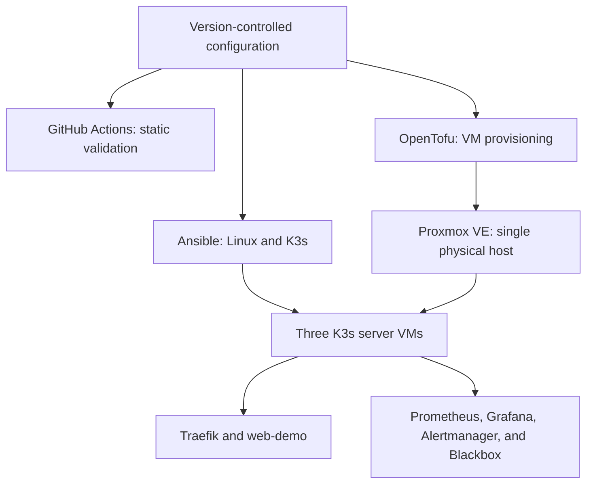

# Homelab Infrastructure Portfolio

[](https://github.com/Capasiter/homelab-portfolio/actions/workflows/infrastructure-validation.yml)

Employment-focused homelab demonstrating Linux administration, Infrastructure as Code, configuration management, isolated networking, troubleshooting, continuous integration, and infrastructure operations across Proxmox VE and Unraid.

> **Current build:** A live-validated three-server K3s control plane on Proxmox now runs a protected application workload and a resource-tuned observability foundation. OpenTofu provisions the infrastructure, Ansible deploys K3s, Kubernetes manifests define the workload, and a version-pinned Helm configuration deploys Prometheus, Grafana, Alertmanager, kube-state-metrics, and node-exporter.

**Career focus:** Linux Systems Administration · Infrastructure Engineering · Cloud Support · Junior DevOps

## Architecture at a Glance



## Validation Evidence

| Area | Verified result |
|---|---|
| Platform | Three K3s server VMs with embedded etcd |
| Application rollout | 148 successful HTTP requests and 0 observed failures |
| Revalidation | 120 successful HTTP requests and 0 observed failures |
| Availability probe | Healthy `200` response, controlled failure, and recovery to healthy |
| Observability | Prometheus, Grafana, Alertmanager, and Blackbox Exporter live validated |
| CI validation | OpenTofu, Ansible, and Kubernetes validation jobs |
| Latest release | [v0.6.0 K3s observability](https://github.com/Capasiter/homelab-portfolio/releases/tag/v0.6.0) |

## Latest Release — K3s Observability (v0.6.0)

The v0.6.0 milestone adds version-pinned and resource-tuned monitoring through the official `kube-prometheus-stack` chart `88.3.0`, including Prometheus Operator `v0.93.0`, Prometheus, Grafana, Alertmanager, kube-state-metrics, and node-exporter. It also adds a hardened blackbox exporter, a 30-second Prometheus Operator `Probe`, and the `WebDemoUnavailable` alert with a one-minute firing hold.

**Validated live:** Helm revision 1 deployed successfully, every monitoring container became Ready with 0 restarts, and one node-exporter pod ran on each K3s server. The 10 GiB Prometheus, 2 GiB Grafana, and 1 GiB Alertmanager claims are Bound through K3s local-path storage. Post-install CPU remained approximately 2–3%, node memory remained approximately 53–57%, Grafana displayed live cluster and workload metrics, `min(up)` returned `1`, and `web-demo` reported 3 desired and 3 available replicas.

**Availability validation:** The healthy endpoint returned `probe_http_status_code 200` and `probe_success 1`. During a controlled scale-to-zero exercise, the failure produced `probe_http_status_code 0` and `probe_success 0`, and `WebDemoUnavailable` transitioned from inactive to pending to firing. Restoring all three replicas returned `probe_success` to `1` and the alert to inactive; `kubectl diff` reported no drift between the two version-controlled manifests and the live cluster.

Live socket inspection showed that K3s exposes API-server and kubelet metrics to the cluster while controller-manager, scheduler, kube-proxy, and etcd metrics remain loopback-only. The unreachable component monitors and associated rules are intentionally disabled instead of weakening K3s defaults or accepting false alerts.

[Review the observability architecture, configuration, validation, and learning queries](kubernetes/observability/README.md)

### Previous Milestone — v0.5.0 Rollout Reliability

The v0.5.0 milestone advanced the portfolio from deploying a Kubernetes platform to operating a workload reliably and validating availability through live client traffic.

**Validated live:** An initial rolling restart completed successfully in Kubernetes but produced one client-visible timeout. After adding an HTTP readiness probe, `minReadySeconds`, `maxUnavailable: 0`, controlled surge capacity, and a 10-second `preStop` drain window, live-traffic tests observed 148 successful requests with 0 failures and a separate revalidation observed 120 successful requests with 0 failures. The final Deployment returned to 3/3 Ready and available, with one pod running on each K3s server.

[Review the complete rolling-update reliability evidence](kubernetes/k8s-learning/README.md)

### Platform Foundation — v0.4.0

[Review the complete K3s cluster validation evidence](ansible/docs/k3s-cluster-validation.md)

OpenTofu currently manages:

| Node | VM ID | Reserved address | Role |
|---|---:|---|---|
| `k3s-server-01` | 401 | `10.20.0.101` | K3s server (control plane + etcd) |
| `k3s-server-02` | 402 | `10.20.0.102` | K3s server (control plane + etcd) |
| `k3s-server-03` | 403 | `10.20.0.103` | K3s server (control plane + etcd) |

Each node is a full clone of a sanitized Ubuntu 24.04 cloud-image template with:

- 2 CPU cores using the host CPU type
- 3072 MB of memory
- 32 GB disk on Proxmox storage
- Cloud-init automation user and SSH public key
- QEMU guest-agent integration
- Deterministic MAC address and DHCP reservation
- Automatic startup after the OPNsense gateway
- Serial-console recovery access
- Networking only on the isolated `vmbr1` bridge

### Network Design

OPNsense separates the K3s environment from the management network:

| Component | Function |
|---|---|
| `vmbr0` | Proxmox management and OPNsense WAN |
| OPNsense VM 400 | Firewall, routing, DHCP, DNS forwarding, and outbound NAT |
| `vmbr1` | Isolated `10.20.0.0/24` lab network |
| VMs 401–403 | K3s infrastructure attached only to `vmbr1` |

The isolated bridge carries VM traffic internally and does not require a connected physical uplink. No upstream-router configuration was changed.

### Deployment Evidence

The deployment demonstrated:

- Reusable OpenTofu VM module design
- Stable VM identity through `for_each`, VM IDs, and MAC addresses
- Controlled canary deployment using `k3s-server-01`
- Recovery from a partially completed, tainted canary resource
- Diagnosis of HTTP `401` authentication and HTTP `403` authorization failures
- A purpose-built Proxmox provisioning role
- Understanding of privilege-separated parent and token ACL intersections
- Dependency-aware startup and reverse-order shutdown
- Cloud-init, guest-agent, routing, NAT, DNS, and SSH validation
- A final non-targeted OpenTofu plan reporting no changes

The K3s deployment additionally demonstrated:

- Dependency-aware bootstrap and sequential joins through idempotent Ansible automation
- Pinned K3s installer and binary artifacts with SHA-256 verification
- Secure in-memory join-token handling and root-owned configuration
- Kubernetes Secrets encryption validated across all three servers
- Healthy Kubernetes API and three-member embedded etcd control plane
- Cross-node scheduling, networking, Service routing, and DNS validation
- Successful local etcd snapshot creation and a full `changed=0` rerun
- Evidence-based correction of an obsolete Kubernetes role-label assertion

> **Current limitations:** The Kubernetes API does not yet use a virtual IP or external load balancer. The etcd snapshot is local-only and restore testing remains pending. Monitoring storage remains node-local. Alertmanager notification delivery, blackbox-exporter redundancy, Unraid-backed shared storage, and GitOps remain future work.

Documentation:

- [K3s environment and architecture](proxmox/opentofu/environments/k3s/README.md)
- [K3s live-validation report](proxmox/opentofu/docs/k3s-live-validation.md)
- [K3s cluster live-validation report](ansible/docs/k3s-cluster-validation.md)
- [Kubernetes rolling-update reliability lab](kubernetes/k8s-learning/README.md)
- [K3s observability architecture and validation](kubernetes/observability/README.md)
- [v0.6.0 release: K3s observability and black-box monitoring](https://github.com/Capasiter/homelab-portfolio/releases/tag/v0.6.0)
- [GitHub Actions run 20: infrastructure validation](https://github.com/Capasiter/homelab-portfolio/actions/runs/32668970647)
- [Proxmox OpenTofu project](proxmox/opentofu/)

## Milestone History

| Milestone | Delivered capability | Status |
|---|---|---|
| v0.1.0 | Reusable OpenTofu module and live Proxmox Ubuntu LXC deployment | Released |
| v0.2.0 | Idempotent Ansible Linux baseline with SSH hardening | Released |
| v0.3.0 | Read-only GitHub Actions infrastructure validation | Released |
| v0.4.0 | Isolated three-node K3s infrastructure and cluster deployment | Released |
| v0.5.0 | K3s application rollout reliability with readiness, graceful termination, and live-traffic validation | Released |
| v0.6.0 | Resource-tuned K3s observability, application probing, and controlled alert recovery | Released |

## Featured Infrastructure Projects

### Proxmox OpenTofu Infrastructure

[View the Proxmox OpenTofu project](proxmox/opentofu/)

The OpenTofu project separates reusable modules from environment compositions:

- `modules/ubuntu-lxc` provisions unprivileged Ubuntu containers
- `modules/ubuntu-vm` provisions cloud-init Ubuntu virtual machines
- `environments/dev` manages the live development container
- `environments/k3s` manages the isolated three-VM foundation

Both live environments have completed full drift checks reporting no changes.

### Ansible Linux Baseline

[View the Ansible Linux baseline](ansible/)

[Read the original development-LXC validation report](ansible/docs/live-validation.md)

[Read the three-node K3s bootstrap validation report](ansible/docs/k3s-node-validation.md)

The reusable `linux_baseline` role provides:

- Ubuntu platform validation
- Administration package installation
- Timezone configuration
- Key-only SSH authentication
- Disabled password and keyboard-interactive authentication
- Disabled direct root SSH login
- SSH configuration validation before restart
- Handler-based service management
- Production-profile linting
- Proven idempotency with `changed=0`

The same baseline is now live-validated on all three K3s nodes, including a full idempotent run with `changed=0` on every node.

### GitHub Actions Infrastructure Validation

[View the validation workflow](.github/workflows/infrastructure-validation.yml)

Every pull request and push to `main` runs independent OpenTofu, Ansible, and Kubernetes observability validation jobs on Ubuntu 24.04.

CI validates OpenTofu formatting and configuration, parses only sanitized Ansible inventory, checks playbook syntax, runs `ansible-lint`, renders the pinned observability Helm chart, and performs strict schema validation of standalone Kubernetes manifests without accessing live infrastructure.

The workflow uses read-only repository permissions and contains no Proxmox credentials, SSH keys, live inventory, or infrastructure state.

## Technology and Status

| Area | Technology | Status |
|---|---|---|
| Virtualization | Proxmox VE 9.2.x | Operational |
| Infrastructure as Code | OpenTofu 1.12.4 and `bpg/proxmox` | Live validated |
| Linux containers | Ubuntu 24.04 LXC | Deployed and configured |
| Virtual machines | Ubuntu 24.04 cloud-init VMs | Three deployed and drift-free |
| Network security | OPNsense isolated lab | Operational |
| Configuration management | Ansible | Linux baseline and K3s deployment live validated |
| Continuous integration | GitHub Actions | Automated validation passing |
| Orchestration | K3s with embedded etcd | Three-server control plane deployed and live validated |
| Application delivery | Kubernetes Deployment, Service, and Traefik Ingress | Protected rolling restart validated under live traffic |
| Observability | Prometheus Operator, Prometheus, Grafana, Alertmanager, Blackbox Exporter, kube-state-metrics, node-exporter | Application probing and controlled alert firing and recovery live validated |
| Cluster storage | K3s local-path provisioner | Operational; node-local only |
| Shared storage | Unraid | Platform operational; K3s integration planned |
| Secure remote access | OpenSSH bastion access | Restricted access live validated |
| Version control | Git and GitHub | Active |

## Engineering Practices Demonstrated

- Reusable Infrastructure as Code modules and environment-specific composition
- Input validation, dependency pinning, and SHA-256 artifact verification
- Deterministic addressing and isolated virtual networking
- Least-privilege access plus secret, state, and plan-file protection
- Idempotent Ansible roles with validation before service changes
- Dependency-aware K3s bootstrap and secure join-token handling
- Kubernetes readiness, graceful termination, and protected rolling updates
- Live client-traffic testing and infrastructure drift detection
- Resource-tuned Helm deployments and persistent-volume planning
- Prometheus target validation, application probing, and controlled alert recovery
- Evidence-driven troubleshooting with documented limitations
- Feature branches, pull-request review, and read-only CI validation

## Repository Structure

```text
homelab-portfolio/
├── .github/          # GitHub Actions validation
├── ansible/          # Linux baseline, K3s automation, and validation
├── kubernetes/       # Workloads, observability, and live-validation evidence
└── proxmox/
    └── opentofu/     # Proxmox modules, environments, and validation evidence
```

## Roadmap

> **Next hands-on experiment — human-supervised AI operations:** Evaluate [Prime Agent](https://github.com/PrimeIntellect-ai/prime-agent) in an isolated Unraid sandbox to explore how AI agents can support log analysis, incident triage, and runbook workflows. **Status: planned and not yet implemented; infrastructure changes will remain human-reviewed and auditable.**

- [x] Provision and validate an Ubuntu LXC with OpenTofu
- [x] Build and live-validate an idempotent Ansible Linux baseline
- [x] Add read-only GitHub Actions infrastructure validation
- [x] Build an isolated OPNsense lab network
- [x] Create and sanitize an Ubuntu cloud-image template
- [x] Provision three deterministic K3s virtual machines
- [x] Confirm a final drift-free OpenTofu plan
- [x] Configure dedicated key-based bastion access
- [x] Apply the Ansible Linux baseline to all three nodes
- [x] Prove three-node baseline idempotency
- [x] Deploy a three-server K3s control plane with embedded etcd
- [x] Validate embedded etcd, cluster DNS, networking, Service routing, and scheduling
- [x] Validate Kubernetes Secrets encryption and local etcd snapshot creation
- [x] Prove full K3s Ansible idempotence with `changed=0`
- [x] Deploy a declarative Kubernetes workload through Traefik
- [x] Validate application availability during protected rolling restarts
- [ ] Add an API virtual IP or external control-plane load balancer
- [ ] Integrate shared persistent storage from Unraid
- [ ] Add off-host etcd snapshot backups and complete a documented restore test
- [x] Deploy a version-pinned, resource-tuned monitoring foundation
- [x] Validate cluster dashboards, scrape health, and persistent storage
- [x] Add black-box application probing and controlled alert/recovery evidence
- [ ] Evaluate [Prime Agent](https://github.com/PrimeIntellect-ai/prime-agent) from [**PrimeIntellect-ai**](https://github.com/PrimeIntellect-ai) in an isolated Unraid sandbox for long-running infrastructure operations and incident-analysis workflows
- [ ] Deploy Argo CD and demonstrate GitOps drift detection and self-healing

## Security

Credentials, API-token secrets, private keys, live inventory, local variable files, provider caches, saved plans, state files, and OPNsense configuration exports are excluded from version control.

Public example configuration contains placeholders only. Proxmox automation uses separate read-only and provisioning tokens, with a purpose-built provisioning role and documented effective-permission testing.

The validation record transparently documents a temporary broader parent ACL and the staged verification required before safely removing it.

K3s installation uses an immutable installer commit plus SHA-256 verification of both the installer and installed binary. Cluster configuration and token files are root-owned with mode `0600`.

Join credentials are suppressed from logs, held in a non-cacheable in-memory Ansible fact during deployment, and never committed to Git. Kubernetes Secrets encryption was enabled and validated across all three servers.

Grafana admin credentials are generated in a separately managed Kubernetes Secret. The committed Helm values reference only the Secret name, while kubeconfig contents remain outside the repository.

GitHub Actions uses read-only repository permissions and no live infrastructure credentials. Public CI performs static validation only and never runs OpenTofu `plan` or `apply`.

State files are treated as sensitive because infrastructure providers can store environment details and secret values in them.

## About

I am building this portfolio to demonstrate practical infrastructure skills through working systems, repeatable automation, controlled troubleshooting, validation, and clear technical documentation.

**Lee Austin**

[GitHub profile](https://github.com/Capasiter)
