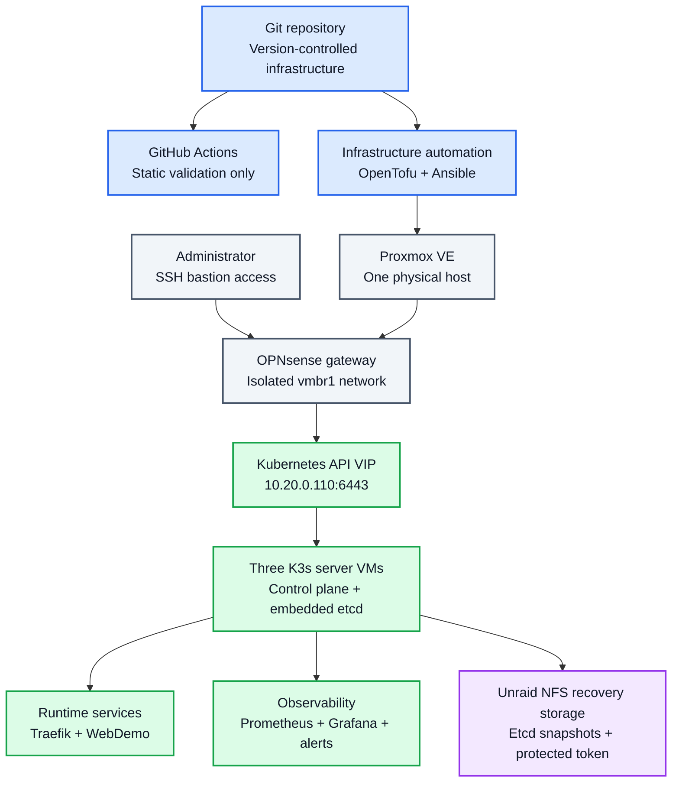
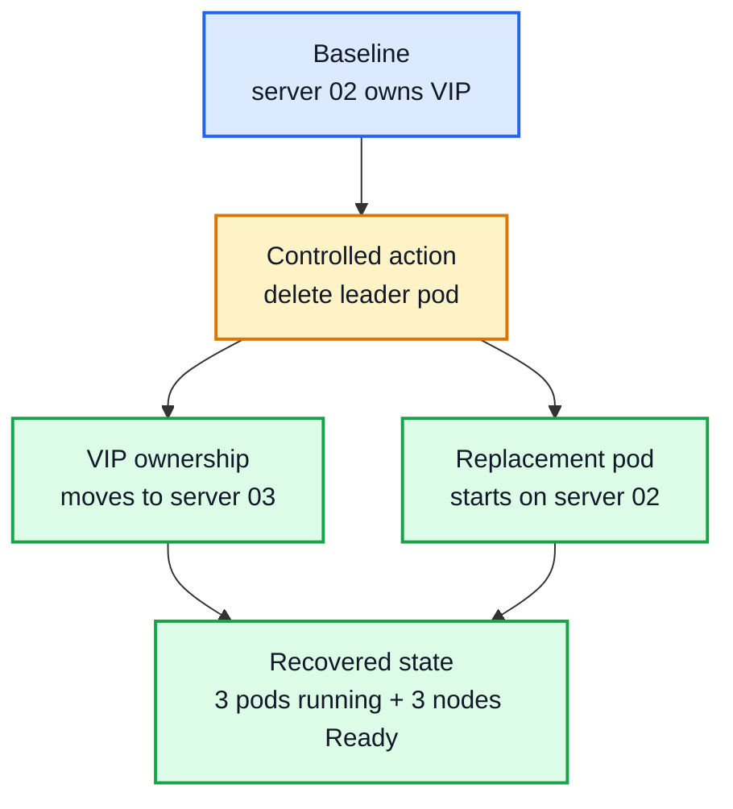
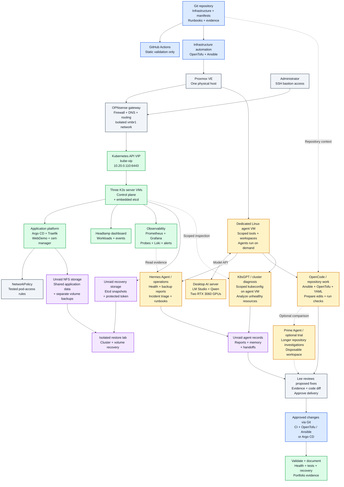

# Homelab Infrastructure Portfolio

### Build it. Operate it. Test what happens when it breaks.

A hands-on infrastructure portfolio by **Lee Austin**: isolated Linux infrastructure, a three-server Kubernetes control plane, repeatable automation, live monitoring, verified off-server backups, and a documented restore investigation.

> **Latest released milestone: Argo CD application delivery.** Deployed in the lab, with preserved drift-detection and manual-reconciliation evidence. [Read the configuration and validation evidence](kubernetes/argocd/README.md).

**[Architecture](#architecture)** · **[Live evidence](#live-evidence)** · **[Engineering stories](#engineering-stories)** · **[Roadmap](#roadmap)** · **[About Lee](#about-lee)**

| Infrastructure | Reliability | Recovery |
|:---|:---|:---|
| **3 K3s server VMs** Control plane + embedded etcd | **148 successful HTTP requests** 0 observed failures in a protected rollout | **Off-server etcd backups** SHA-256 verification + protected token |
| **Internal API VIP** kube-vip DaemonSet across all 3 servers | **Leader-pod handoff observed** VIP moved from server 02 to server 03 | **Restore drill attempted** Decompression verified; full restore blocked |

> **GitOps validation:** Argo CD detected replica drift from three to four; manual reconciliation restored WebDemo to Synced, Healthy, and 3/3 Ready and available replicas.
>
> **Latest release:** [v0.9.0 — Argo CD GitOps Delivery](https://github.com/Capasiter/homelab-portfolio/releases/tag/v0.9.0).
>
> **Scope:** Three VMs on **one physical Proxmox host**. This demonstrates control-plane redundancy and a pod-level failover exercise, not physical-host high availability. Full etcd restore remains incomplete.

## Architecture

The lab separates provisioning, configuration, runtime services, and off-server backups. Kubernetes API access stays inside the isolated lab; administration uses an SSH bastion.

```mermaid
flowchart TD
    Git["Git repository<br/>Version-controlled infrastructure"]
    CI["GitHub Actions<br/>Static validation only"]
    Automation["Infrastructure automation<br/>OpenTofu + Ansible"]
    Proxmox["Proxmox VE<br/>One physical host"]
    Admin["Administrator<br/>SSH bastion access"]
    Gateway["OPNsense gateway<br/>Isolated vmbr1 network"]
    VIP["Kubernetes API VIP<br/>10.20.0.110:6443"]
    Cluster["Three K3s server VMs<br/>Control plane + embedded etcd"]
    Services["Runtime services<br/>Traefik + WebDemo"]
    Observe["Observability<br/>Prometheus + Grafana + alerts"]
    Backup["Unraid NFS recovery storage<br/>Etcd snapshots + protected token"]

    Git --> CI
    Git --> Automation
    Automation --> Proxmox
    Admin --> Gateway
    Proxmox --> Gateway
    Gateway --> VIP
    VIP --> Cluster
    Cluster --> Services
    Cluster --> Observe
    Cluster --> Backup

    classDef delivery fill:#DBEAFE,stroke:#2563EB,color:#111827,stroke-width:2px,font-size:17px
    classDef boundary fill:#F1F5F9,stroke:#475569,color:#111827,stroke-width:2px,font-size:17px
    classDef runtime fill:#DCFCE7,stroke:#16A34A,color:#111827,stroke-width:2px,font-size:17px
    classDef recovery fill:#F3E8FF,stroke:#9333EA,color:#111827,stroke-width:2px,font-size:17px

    class Git,CI,Automation delivery
    class Proxmox,Admin,Gateway boundary
    class VIP,Cluster,Services,Observe runtime
    class Backup recovery
```

**Blue:** delivery and automation · **Green:** running platform · **Purple:** off-server recovery data · **Gray:** access and network boundaries.

The diagram groups workloads logically. The three K3s VMs share the same physical host; the VIP is owned by one server at a time, not a separate appliance. CI performs static checks and does not deploy to the live lab.

<strong>Expand: node sizing and network design</strong>

| Node | VM ID | Address | Role |
|---|---:|---|---|
| `k3s-server-01` | 401 | `10.20.0.101` | Control plane + etcd |
| `k3s-server-02` | 402 | `10.20.0.102` | Control plane + etcd |
| `k3s-server-03` | 403 | `10.20.0.103` | Control plane + etcd |

Each VM uses 4 CPU cores, 6144 MB RAM, a 32 GB disk, Ubuntu 24.04, cloud-init, and the QEMU guest agent. OpenTofu defines stable VM identities, addressing, and startup dependencies.

OPNsense VM 400 provides routing, DHCP, DNS forwarding, and outbound NAT. `vmbr0` carries management and OPNsense WAN traffic; `vmbr1` is the isolated lab bridge. No upstream-router changes or physical uplink on the isolated bridge are required.

[Provisioning and network implementation](proxmox/opentofu/environments/k3s/README.md)

## Live evidence

These are bounded test results, not uptime guarantees. Each link leads to implementation details or a validation record.

| Test | Observed result | Evidence |
|---|---|---|
| Infrastructure convergence | Full OpenTofu checks reported no changes in the documented runs | [Provisioning validation](proxmox/opentofu/docs/k3s-live-validation.md) |
| Linux and cluster automation | Live Ansible idempotence demonstrated with `changed=0` | [Node baseline](ansible/docs/k3s-node-validation.md) · [Cluster deployment](ansible/docs/k3s-cluster-validation.md) |
| Protected application rollout | 148 successful HTTP requests, 0 observed failures; separate revalidation: 120 successful, 0 failures | [Rolling-update lab](kubernetes/k8s-learning/README.md) |
| Availability alert lifecycle | Healthy → controlled failure → firing alert → recovery | [Observability validation](kubernetes/observability/README.md) |
| Off-server backup workflow | Snapshot, baseline/rolling retention, token protection, and checksum verification validated | [Backup and restore record](docs/portfolio-history-through-v0.7.md#restore-validation) |
| API leader-pod failover | VIP moved 02 → 03; no failed API probes recorded; 3/3 kube-vip pods and 3 Ready nodes afterward | [VIP validation](ansible/docs/k3s-api-vip-validation.md) |
| GitOps drift detection and manual reconciliation | Replica drift detected; manual sync restored Synced, Healthy, and 3/3 Ready replicas | [GitOps validation](kubernetes/argocd/README.md) |

**What the CI badge means:** repository validation status. It is not a live cluster-health indicator.

## Engineering stories

### 01 / A green rollout was not enough

The first rolling restart completed in Kubernetes but still produced a client-visible timeout. I added readiness checks, a minimum readiness interval, zero-unavailable rolling updates, controlled surge capacity, and a graceful drain window, then retested with live HTTP traffic.

**Result:** 148 successful requests with no observed failures in the protected rollout test.

[Read the failure, fix, and revalidation](kubernetes/k8s-learning/README.md)

### 02 / Backups needed more than a successful copy

Live testing exposed unexpected NFS ownership and checksum files retaining stale ownership. The fixes scoped the export policy to the trusted backup client and applied atomic write-then-rename handling to checksum files.

**Result:** verified off-server snapshot and token backups, protected baseline plus three rolling backups, and daily scheduling. An isolated restore attempt verified snapshot decompression but encountered a reproducible K3s reset-path panic. Full restore is **not** claimed as successful.

[Read the backup findings and restore limitation](docs/portfolio-history-through-v0.7.md#current-milestone---k3s-backup-and-recovery-readiness-v070)

### 03 / The API endpoint survived a leader-pod handoff

The API VIP is included in the K3s certificate SANs and managed by a kube-vip DaemonSet. During the September 19 test, the current leader pod on server 02 was deleted while API readiness probes ran through the VIP.

```mermaid
flowchart TD
    Before["Baseline<br/>server 02 owns VIP"]
    Action["Controlled action<br/>delete leader pod"]
    Move["VIP ownership<br/>moves to server 03"]
    Replace["Replacement pod<br/>starts on server 02"]
    Healthy["Recovered state<br/>3 pods running + 3 nodes Ready"]

    Before --> Action
    Action --> Move
    Action --> Replace
    Move --> Healthy
    Replace --> Healthy

    classDef initial fill:#DBEAFE,stroke:#2563EB,color:#111827,stroke-width:2px,font-size:16px
    classDef action fill:#FEF3C7,stroke:#D97706,color:#111827,stroke-width:2px,font-size:16px
    classDef healthy fill:#DCFCE7,stroke:#16A34A,color:#111827,stroke-width:2px,font-size:16px

    class Before initial
    class Action action
    class Move,Replace,Healthy healthy
```

**Result:** ownership moved to server 03, the deleted pod was replaced, and no failed API probes were recorded. The test did not measure application traffic or establish a zero-downtime bound.

[Read the test method, observed state, and limitations](ansible/docs/k3s-api-vip-validation.md)

## Explore the implementation

| Area | What to inspect |
|---|---|
| Infrastructure as code | [OpenTofu modules and environments](proxmox/opentofu/) |
| Host and cluster automation | [Ansible roles and playbooks](ansible/) |
| Stable API endpoint | [kube-vip role](ansible/roles/k3s_api_vip/) · [Cluster orchestration](ansible/playbooks/k3s_cluster.yml) |
| Application reliability | [Kubernetes workload and validation](kubernetes/k8s-learning/README.md) |
| Monitoring and alerting | [Observability configuration and evidence](kubernetes/observability/README.md) |
| GitOps application delivery | [Argo CD configuration and validation](kubernetes/argocd/README.md) · [WebDemo Application](kubernetes/argocd/applications/web-demo.yaml) |
| CI and change history | [Validation workflow](.github/workflows/infrastructure-validation.yml) · [Changelog](CHANGELOG.md) |
| Earlier engineering detail | [Preserved v0.1–v0.7 portfolio record](docs/portfolio-history-through-v0.7.md) |

<strong>Expand: security and operating practices</strong>

- Isolated lab networking and key-based SSH bastion access; no public Kubernetes API.
- Dedicated automation identities and documented Proxmox permission testing.
- Pinned K3s artifacts with SHA-256 verification.
- Root-owned K3s configuration and token files with mode `0600`.
- Sensitive join-token operations suppressed from logs and transferred through a non-cacheable in-memory Ansible fact.
- Kubernetes Secrets encryption validated across all three servers.
- Grafana credentials managed separately from committed Helm values.
- Read-only GitHub Actions repository permissions; static checks without live infrastructure credentials.
- Credentials, private keys, kubeconfigs, sensitive local inventory, state, saved plans, and configuration exports excluded from version control.
- A dedicated NFS export uses `no_root_squash` for the trusted backup client to preserve required ownership. This is a scoped lab tradeoff, not a general production recommendation.
- Feature branches, pull requests, checks, and documented live validation.

[Detailed security record and tradeoffs](docs/portfolio-history-through-v0.7.md#security)

## Roadmap

| Stage | Capability | Status |
|---|---|---|
| v0.1–v0.3 | OpenTofu foundation, hardened Linux baseline, read-only CI | Released |
| v0.4 | Three-server K3s control plane with embedded etcd | Released |
| v0.5 | Protected application rollouts tested under traffic | Released |
| v0.6 | Monitoring, application probing, and alert recovery | Released |
| v0.7 | Off-server backups, integrity checks, retention, and restore investigation | Released; full restore incomplete |
| v0.8 | Stable internal API VIP and leader-pod failover validation | Released |
| v0.9 | Argo CD application delivery with drift detection and manual reconciliation | Released |
| Next | Unraid-backed shared application storage and volume-recovery validation | Planned |
| Follow-up | Complete restore validation; notification delivery; broader failure testing | Not yet completed |
| Future | Human-supervised AI operations for log analysis, incident triage, and runbook assistance | Planned; not deployed |

The next-stage ordering is a roadmap, not a release commitment. AI-assisted operations will start in an isolated sandbox, with human-reviewed, auditable infrastructure changes.

### Boundaries worth knowing

- **Single physical host:** control-plane VM redundancy does not protect against loss of the Proxmox host.
- **Recovery:** snapshot integrity and decompression are validated; full etcd restore is not complete.
- **Storage:** current application and monitoring volumes use node-local storage. Etcd snapshots do not back up persistent-volume contents.
- **Failover:** the recorded exercise deleted one kube-vip pod. It did not power off a node, interrupt the network, or test physical-host failure.
- **Monitoring:** outbound alert delivery and blackbox-exporter redundancy remain future work.
- **GitOps:** Argo CD uses manual sync; automated sync, self-heal, and automatic pruning are disabled. Its installation is bootstrapped manually and is not self-managed. Continuous HTTP availability during reconciliation was not tested.
- **Isolation:** Kubernetes NetworkPolicy is not claimed as implemented.

## About Lee

I am transitioning from manufacturing, field service, and paid computer repair into Linux systems, infrastructure operations, and cloud support. This portfolio shows how I build working systems, investigate failures, automate repeatable operations, and document what the evidence actually proves.

**Focus:** Linux / Infrastructure Support · Systems Administration · Cloud Operations · Junior DevOps

[GitHub](https://github.com/Capasiter) · [LinkedIn](https://www.linkedin.com/in/leeaustinmn/)

**[Download Lee Austin’s Infrastructure Support Resume (PDF)](resume/Lee_Austin_Infrastructure_Support_Resume_2026.pdf)**

## Future architecture — completed-state vision

> **Proposed design, not deployed evidence.** This connected architecture assigns different tools to operations, repository work, and Kubernetes diagnosis. Model assignments are starting points to test, not measured winners.

```mermaid
%%{init: {"flowchart": {"nodeSpacing": 20, "rankSpacing": 90, "curve": "basis"}, "themeVariables": {"fontSize": "20px"}}}%%
flowchart TD
    Git["Git repository<br/>Infrastructure + manifests<br/>Runbooks + evidence"]
    CI["GitHub Actions<br/>Static validation only"]
    Automation["Infrastructure automation<br/>OpenTofu + Ansible"]
    Proxmox["Proxmox VE<br/>One physical host"]
    Admin["Administrator<br/>SSH bastion access"]
    Network["OPNsense gateway<br/>Firewall + DNS + routing<br/>Isolated vmbr1 network"]
    VIP["Kubernetes API VIP<br/>kube-vip<br/>10.20.0.110:6443"]
    Cluster["Three K3s server VMs<br/>Control plane<br/>+ embedded etcd"]
    Apps["Application platform<br/>Argo CD + Traefik<br/>WebDemo + cert-manager"]
    Dashboard["Headlamp dashboard<br/>Workloads + events"]
    Observe["Observability<br/>Prometheus + Grafana<br/>Probes + Loki + alerts"]
    Policies["NetworkPolicy<br/>Tested pod-access rules"]
    Storage["Unraid NFS storage<br/>Shared application data<br/>+ separate volume backups"]
    Backup["Unraid recovery storage<br/>Etcd snapshots<br/>+ protected token"]
    Restore["Isolated restore lab<br/>Cluster + volume recovery"]

    Workspace["Dedicated Linux agent VM<br/>Scoped tools + workspaces<br/>Agents run on demand"]
    Desktop["Desktop AI server<br/>LM Studio + Qwen<br/>Two RTX 3060 GPUs"]
    Hermes["Hermes Agent / operations<br/>Health + backup reports<br/>Incident triage + runbooks"]
    OpenCode["OpenCode / repository work<br/>Ansible + OpenTofu + YAML<br/>Prepare edits + run checks"]
    K8sGPT["K8sGPT / cluster diagnosis<br/>Scoped kubeconfig on agent VM<br/>Analyze unhealthy resources"]
    Prime["Prime Agent / optional trial<br/>Longer repository investigations<br/>Disposable workspace"]
    Records["Unraid agent records<br/>Reports + memory<br/>+ handoffs"]
    Review["Lee reviews proposed fixes<br/>Evidence + code diff<br/>Approve delivery"]
    Delivery["Approved changes via Git<br/>CI + OpenTofu / Ansible<br/>or Argo CD"]
    Verify["Validate + document<br/>Health + tests + recovery<br/>Portfolio evidence"]

    Git --> CI
    Git --> Automation
    Automation --> Proxmox
    Admin --> Network
    Proxmox --> Network
    Network --> VIP
    VIP --> Cluster
    Cluster --> Apps
    Cluster --> Dashboard
    Cluster --> Observe
    Apps --> Policies
    Apps --> Storage
    Cluster --> Backup
    Storage --> Restore
    Backup --> Restore

    Proxmox ----> Workspace
    Workspace <-->|Model API| Desktop
    Workspace --> Hermes
    Workspace --> OpenCode
    Workspace --> K8sGPT
    OpenCode -.->|Optional comparison| Prime
    Observe -.->|Read evidence| Hermes
    Cluster -.->|Scoped inspection| K8sGPT
    Git -.->|Repository context| OpenCode
    Hermes --> Records
    K8sGPT --> Records
    OpenCode --> Review
    Prime -.-> Review
    Records --> Review
    Review --> Delivery
    Delivery --> Verify

    classDef delivery fill:#DBEAFE,stroke:#2563EB,color:#111827,stroke-width:2px,font-size:20px
    classDef boundary fill:#F1F5F9,stroke:#475569,color:#111827,stroke-width:2px,font-size:20px
    classDef runtime fill:#DCFCE7,stroke:#16A34A,color:#111827,stroke-width:2px,font-size:20px
    classDef recovery fill:#F3E8FF,stroke:#9333EA,color:#111827,stroke-width:2px,font-size:20px
    classDef ai fill:#FEF3C7,stroke:#D97706,color:#111827,stroke-width:2px,font-size:20px

    class Git,CI,Automation,Delivery delivery
    class Proxmox,Admin,Network,Policies,Review boundary
    class VIP,Cluster,Apps,Dashboard,Observe,Verify runtime
    class Storage,Backup,Restore,Records recovery
    class Workspace,Desktop,Hermes,OpenCode,K8sGPT,Prime ai
```

**Blue:** delivery and automation · **Green:** running platform · **Purple:** storage and recovery · **Gray:** access, network boundaries, and review · **Amber:** AI tools and local inference.

The connections show logical responsibilities and evidence flow. Hermes handles recurring operations and reporting; OpenCode prepares repository changes; K8sGPT provides specialized cluster diagnosis. Prime Agent is an optional comparison for longer investigations, not a dependency of OpenCode or a required always-on service.

<strong>Expand: agent tasks, model choices, and placement</strong>

| Task | Tool to evaluate | Initial model experiment |
|---|---|---|
| Daily health, capacity, and backup-freshness report | **Hermes Agent** | Qwen3.5-9B |
| Investigate events, logs, and incidents | **Hermes Agent** | Qwen3.5-27B for harder cases |
| DNS, TLS, endpoint, and firewall inspection | **Hermes Agent** with scoped commands | 9B summaries; 27B for difficult cases |
| Prepare Ansible, OpenTofu, and Kubernetes changes | **OpenCode** | The locally available Qwen Coder model |
| Explain unhealthy Kubernetes resources | **K8sGPT** | Test a supported local backend; verify the exact LM Studio connection |
| Longer repository investigations | **Prime Agent**, optional | Qwen Coder or 27B, evaluated on the same task |
| Runbook updates, handoffs, and evidence summaries | **Hermes Agent** | Qwen3.5-9B |

**Proxmox:** the existing infrastructure and K3s VMs, plus one dedicated Linux agent VM. General-purpose agents stay outside the cluster so they can investigate it when it is unhealthy. Run coding experiments and restore drills on demand.

**Desktop:** LM Studio serves local models on the two RTX 3060 GPUs. Begin with one active model and queued tasks; validate model fit, context, speed, and tool use before adding concurrency.

**Unraid:** application storage, independent recovery artifacts, and durable agent reports and handoffs.

**K3s additions to evaluate:** Headlamp for a Kubernetes dashboard; cert-manager for certificate automation; Loki for logs; tested NetworkPolicies for scoped pod access. K8sGPT starts as a CLI on the agent VM; its operator is a later optional cluster experiment. These are proposed additions, not claims about the current cluster.

**Review path:** agents collect evidence and prepare fixes. Lee reviews changes before the appropriate infrastructure or application delivery process. GitHub Actions stays static validation only.

**Completed-state targets:** shared application storage and volume recovery tested; full isolated etcd restore validated; outbound notifications delivered and tested; network access rules verified; agent workflows evaluated on real lab tasks; reviewed changes and evidence preserved.

**Selection test:** compare agents with the same model on a broken-pod diagnosis, backup-freshness report, and small Ansible fix in a test branch. Check correct tool use, evidence quality, completion, elapsed time, and needed intervention.

Sources: [Hermes](https://hermes-agent.nousresearch.com/docs/) · [OpenCode](https://opencode.ai/v2/docs/providers) · [K8sGPT](https://github.com/k8sgpt-ai/k8sgpt) · [Prime Agent](https://github.com/PrimeIntellect-ai/prime-agent) · [Headlamp](https://kubernetes-sigs.github.io/headlamp/) · [K3s networking](https://docs.k3s.io/networking)

The three K3s servers and agent VM still share one physical host. GPU inference requires the desktop endpoint to be available. Full recovery, new networking controls, and local agent performance must be validated before they appear as deployed portfolio evidence.

