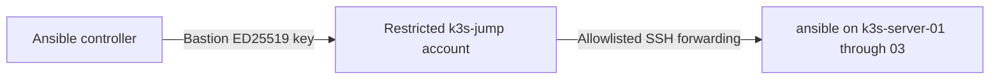

# Ansible Linux Baseline and K3s Deployment

This project applies a repeatable Ubuntu Linux baseline and deploys an isolated three-server K3s control plane on OpenTofu-managed Proxmox VE infrastructure.

OpenTofu manages infrastructure lifecycle. Ansible configures operating-system packages, timezone, SSH security, kernel and networking prerequisites, K3s bootstrap, sequential server joins, and runtime validation.

> **Current status:** The Linux baseline is live-validated on one Ubuntu LXC and three isolated Ubuntu VMs. K3s `v1.36.2+k3s1` is deployed across three control-plane and etcd members, all reporting Ready. A complete cluster playbook rerun converged with `changed=0` on every node.

## Delivered Configuration

The reusable `linux_baseline` role:

- Confirms the managed host is running Ubuntu
- Refreshes the APT package cache
- Installs standard Linux administration packages
- Configures the `America/Chicago` timezone
- Disables SSH password authentication
- Disables keyboard-interactive SSH authentication
- Disables direct root SSH login
- Preserves public-key SSH authentication
- Validates SSH configuration before service restart
- Produces repeatable, idempotent results

The reusable `k3s_server` role:

- Validates supported hosts and K3s prerequisites before making changes
- Configures required kernel modules and networking sysctl settings
- Renders root-owned K3s configuration with mode `0600`
- Installs K3s `v1.36.2+k3s1` through a commit-pinned installer and verifies installer and binary SHA-256 checksums
- Bootstraps `k3s-server-01` as the first control-plane and etcd member
- Passes the join token through a non-cacheable in-memory Ansible fact with sensitive tasks suppressed from logs
- Joins `k3s-server-02` and `k3s-server-03` sequentially
- Enables Kubernetes Secrets encryption
- Validates service state, node readiness, and current control-plane and etcd labels
- Produces a repeatable deployment that converges with `changed=0`

## Validated Environments

| Environment | Targets | Access path | Result |
|---|---:|---|---|
| Development | One Ubuntu 24.04 LXC | Direct SSH | Passed |
| K3s control plane | Three Ubuntu 24.04 VMs | Restricted ProxyJump | Passed; three `Ready` server nodes |

Validation evidence:

- [Development LXC validation](docs/live-validation.md)
- [K3s node-bootstrap validation](docs/k3s-node-validation.md)
- [K3s cluster deployment validation](docs/k3s-cluster-validation.md)
- [OpenTofu K3s infrastructure](../proxmox/opentofu/environments/k3s/README.md)

## Inventory Design

The inventory separates general Linux management from environment-specific automation:

```text
@all:
  |--@ungrouped:
  |--@linux_servers:
  |  |--@development:
  |  |  |--ubuntu-dev-01
  |  |--@k3s_cluster:
  |  |  |--@k3s_servers:
  |  |  |  |--@k3s_bootstrap_server:
  |  |  |  |  |--k3s-server-01
  |  |  |  |--@k3s_join_servers:
  |  |  |  |  |--k3s-server-02
  |  |  |  |  |--k3s-server-03
```

This supports several targeting scopes:

| Group | Purpose |
|---|---|
| `linux_servers` | Apply the reusable Ubuntu baseline everywhere |
| `development` | Manage the existing development container |
| `k3s_cluster` | Target the complete K3s deployment workflow |
| `k3s_servers` | Target the three K3s server nodes |
| `k3s_bootstrap_server` | Initialize `k3s-server-01` as the first control-plane and etcd member |
| `k3s_join_servers` | Join `k3s-server-02` and `k3s-server-03` sequentially |

The subgroup design makes the bootstrap dependency explicit and allows join servers to be processed sequentially without relying on an arbitrary host order.

The committed `hosts.example.yml` contains sanitized values. The live `hosts.yml` remains excluded from Git.

## Restricted Bastion Access

The Ansible controller does not directly route into the isolated K3s subnet.

A dedicated forwarding-only account on the Proxmox host provides the management path:



The bastion account has:

- Locked password
- No sudo or administrative groups
- `/usr/sbin/nologin`
- No interactive shell, TTY, SFTP, agent forwarding, or X11
- Local TCP forwarding only
- Exact destination allowlisting
- Source-address restriction
- A separate passphrase-protected key

The target nodes use `homelab_ansible_ed25519`. The bastion never receives or forwards that private key.

The inventory references a local SSH alias:

```yaml
ansible_ssh_common_args: >-
  -o ProxyJump=pve-k3s-bastion
```

The controller’s private `~/.ssh/config` defines that alias and remains outside the repository.

A sanitized client entry has this form:

```sshconfig
Host pve-k3s-bastion
    HostName 192.0.2.20
    User k3s-jump
    IdentityFile ~/.ssh/homelab_bastion_ed25519
    IdentitiesOnly yes
    BatchMode yes
    RequestTTY no
    ForwardAgent no
```

Replace the documentation address only in the private local SSH configuration.

No upstream-router or physical-network changes are required.

## Repository Structure

```text
ansible/
├── docs/
│   ├── live-validation.md
│   ├── k3s-node-validation.md
│   └── k3s-cluster-validation.md
├── inventory/
│   └── hosts.example.yml
├── playbooks/
│   ├── linux_baseline.yml
│   └── k3s_cluster.yml
├── roles/
│   ├── linux_baseline/  # Packages, timezone, and SSH hardening
│   └── k3s_server/      # Preflight, prerequisites, configuration, installation, and validation
├── .gitignore
├── ansible.cfg
└── README.md
```

## Requirements

- Ansible Core 2.16 or newer
- Ubuntu targets with Python 3 and OpenSSH
- Dedicated `ansible` automation account
- Target public-key authentication
- Passwordless sudo for the automation account
- Controller SSH key stored outside the repository
- Network access, direct or through an approved bastion
- Recovery access through the Proxmox console

For isolated K3s access:

- Restricted `k3s-jump` account
- Separate bastion key
- Bastion key unlocked and loaded into `ssh-agent`
- Private `pve-k3s-bastion` SSH alias

Private SSH keys, live inventory, passwords, and other credentials must never be committed.

## Inventory Setup

From the `ansible/` directory, create a private live inventory from the sanitized example:

```bash
if test -e inventory/hosts.yml; then
  echo "STOP: inventory/hosts.yml already exists."
else
  install -m 600 inventory/hosts.example.yml inventory/hosts.yml
fi
```

Replace documentation addresses with local environment values. Keep group names unchanged so playbooks and CI use the same inventory hierarchy.

The default target key path is:

```text
~/.ssh/homelab_ansible_ed25519
```

For a passphrase-protected bastion key, start an agent and load it:

```bash
eval "$(ssh-agent -s)"
ssh-add ~/.ssh/homelab_bastion_ed25519
```

Passphrases and private keys remain local to the controller.

## Validation Workflow

Run these commands from the `ansible/` directory.

### Linux baseline workflow

Inspect inventory:

```bash
ansible-inventory --graph
```

Test the three isolated nodes:

```bash
ansible k3s_servers -m ansible.builtin.ping
```

Check playbook syntax:

```bash
ansible-playbook playbooks/linux_baseline.yml --syntax-check
```

Preview a canary:

```bash
ansible-playbook playbooks/linux_baseline.yml \
  --limit k3s-server-01 \
  --check \
  --diff
```

Apply to the canary:

```bash
ansible-playbook playbooks/linux_baseline.yml \
  --limit k3s-server-01 \
  --diff
```

Validate SSH access and effective security settings before expanding the rollout.

Apply to the remaining nodes:

```bash
ansible-playbook playbooks/linux_baseline.yml \
  --limit 'k3s-server-02:k3s-server-03' \
  --diff
```

Prove idempotency across the group:

```bash
ansible-playbook playbooks/linux_baseline.yml \
  --limit k3s_servers
```

A successful convergence run reports `changed=0`, `unreachable=0`, and `failed=0` for every node.

## Linux Baseline Validation Results

Initial canary apply:

```text
k3s-server-01 : ok=9 changed=6 unreachable=0 failed=0
```

Remaining-node rollout:

```text
k3s-server-02 : ok=9 changed=6 unreachable=0 failed=0
k3s-server-03 : ok=9 changed=6 unreachable=0 failed=0
```

Idempotence validation:

```text
k3s-server-01 : ok=7 changed=0 unreachable=0 failed=0
k3s-server-02 : ok=7 changed=0 unreachable=0 failed=0
k3s-server-03 : ok=7 changed=0 unreachable=0 failed=0
```

## K3s Deployment Workflow

The `k3s_cluster.yml` playbook runs the `k3s_server` role in dependency order:

1. Validate prerequisites and configure every server.
2. Bootstrap `k3s-server-01` as the first control-plane and etcd member.
3. Read the bootstrap join token with `no_log` into a non-cacheable in-memory Ansible fact.
4. Join `k3s-server-02` and `k3s-server-03` sequentially.
5. Validate K3s service state, node readiness, and current role labels.

Check syntax before execution:

```bash
ansible-playbook playbooks/k3s_cluster.yml --syntax-check
```

Check mode can preview managed prerequisites and configuration on the established cluster:

```bash
ansible-playbook playbooks/k3s_cluster.yml --check
```

Check mode is a planning aid. It does not prove a fresh K3s installation, token generation, node joins, embedded-etcd health, or workload networking; those require live execution and runtime validation.

Run the complete deployment workflow:

```bash
ansible-playbook playbooks/k3s_cluster.yml
```

### Live cluster results

- All three nodes reported `Ready` with version `v1.36.2+k3s1`
- Every node reported the `control-plane` and `etcd` roles
- Kubernetes API readiness and embedded-etcd readiness passed
- Kubernetes Secrets encryption was enabled with matching hashes
- Cross-node scheduling, Flannel networking, Service routing, and CoreDNS resolution passed
- Metrics Server, Traefik, ServiceLB, and Local Path Provisioner were healthy
- Local etcd snapshot creation completed successfully
- A complete rerun converged with `changed=0`, `failed=0`, and `unreachable=0` on every node

### Evidence-based troubleshooting

The initial deployment returned `rc=2` because the final validation expected the obsolete `node-role.kubernetes.io/master` label. Live node evidence showed the cluster was healthy and used the current `control-plane` and `etcd` labels. Only the obsolete assertion was removed; lint, CI, and the complete playbook were rerun successfully without unnecessary cluster changes.

[Review the complete live cluster validation](docs/k3s-cluster-validation.md)

## Continuous Integration

GitHub Actions validates the public automation without accessing live infrastructure.

CI:

- Parses `hosts.example.yml`
- Checks syntax for both `linux_baseline.yml` and `k3s_cluster.yml`
- Runs `ansible-lint` with the production profile
- Uses read-only repository permissions
- Contains no live inventory, SSH keys, passwords, or infrastructure credentials

## Security

- Separate identities are used for bastion and target access
- Bastion key is passphrase protected
- SSH-agent forwarding is disabled
- Bastion forwarding is destination allowlisted
- Automation account uses key-only authentication
- Password and keyboard-interactive login are disabled
- Direct root SSH login is disabled
- SSH configuration is validated before restart
- Live inventory and private keys are excluded from Git
- Public inventory contains sanitized values
- Proxmox console remains available for recovery
- Canary deployment limits the initial blast radius

K3s-specific controls include:

- Installer retrieval pinned to an immutable Git commit
- SHA-256 verification of both the installer and installed K3s binary
- Root-owned cluster configuration and token files with mode `0600`
- Sensitive token tasks protected with `no_log` and token-file copies protected with `diff: false`
- Bootstrap token transferred between plays only through a non-cacheable in-memory Ansible fact
- Kubernetes Secrets encryption enabled and validated across all servers

## Current Limitations

- The roles currently support Ubuntu only
- Live inventory requires an initial local setup
- Bastion key must be explicitly unlocked and available through `ssh-agent` before use
- Proxmox is used as a forwarding-only bastion in this homelab
- A production environment would normally use a dedicated bastion, managed VPN, or identity-aware access proxy
- Kubernetes API clients do not yet use a virtual IP or external load balancer
- The validated etcd snapshot remains local-only, and restore testing is pending
- Local Path Provisioner storage is node-local; shared Unraid storage is not yet integrated
- Monitoring, alerting, and GitOps are not yet deployed

## Future Milestones

After v0.4.0, planned production-oriented improvements include:

1. Add a virtual IP or external load balancer for Kubernetes API access.
2. Copy etcd snapshots off-cluster and complete a documented restore exercise.
3. Integrate shared persistent storage from Unraid.
4. Deploy monitoring and alerting.
5. Add GitOps-managed application deployment.
