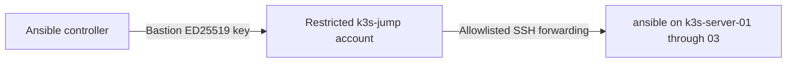

# Ansible Linux Baseline

This project applies a repeatable Linux server baseline to Ubuntu infrastructure provisioned by OpenTofu on Proxmox VE.

OpenTofu manages infrastructure lifecycle. Ansible configures operating-system packages, timezone, and SSH security; K3s installation and configuration are the next phase.

> **Current status:** The baseline is live-validated on one Ubuntu LXC and three isolated Ubuntu VMs prepared for K3s. All three K3s nodes completed an idempotent run with `changed=0`.

## Delivered Configuration

The reusable `linux_baseline` role:

- Confirms the managed host is running Ubuntu
- Refreshes the APT package cache
- Installs standard Linux administration packages
- Configures the `America/Chicago` timezone
- Disables SSH password authentication
- Disables keyboard-interactive SSH authentication
- Disables direct root SSH login
- Preserves public-key SSH authentication
- Validates SSH configuration before service restart
- Produces repeatable, idempotent results

## Validated Environments

| Environment | Targets | Access path | Result |
|---|---:|---|---|
| Development | One Ubuntu 24.04 LXC | Direct SSH | Passed |
| K3s infrastructure | Three Ubuntu 24.04 VMs | Restricted ProxyJump | Passed |

Validation evidence:

- [Development LXC validation](docs/live-validation.md)
- [K3s node-bootstrap validation](docs/k3s-node-validation.md)
- [OpenTofu K3s infrastructure](../proxmox/opentofu/environments/k3s/README.md)

## Inventory Design

The inventory separates general Linux management from environment-specific automation:

```text
@all:
  |--@ungrouped:
  |--@linux_servers:
  |  |--@development:
  |  |  |--ubuntu-dev-01
  |  |--@k3s_cluster:
  |  |  |--@k3s_servers:
  |  |  |  |--k3s-server-01
  |  |  |  |--k3s-server-02
  |  |  |  |--k3s-server-03
```

This supports several targeting scopes:

| Group | Purpose |
|---|---|
| `linux_servers` | Apply the reusable Ubuntu baseline everywhere |
| `development` | Manage the existing development container |
| `k3s_cluster` | Run future cluster-wide automation |
| `k3s_servers` | Target the three K3s server nodes |

The committed `hosts.example.yml` contains sanitized values. The live `hosts.yml` remains excluded from Git.

## Restricted Bastion Access

The Ansible controller does not directly route into the isolated K3s subnet.

A dedicated forwarding-only account on the Proxmox host provides the management path:



The bastion account has:

- Locked password
- No sudo or administrative groups
- `/usr/sbin/nologin`
- No interactive shell, TTY, SFTP, agent forwarding, or X11
- Local TCP forwarding only
- Exact destination allowlisting
- Source-address restriction
- A separate passphrase-protected key

The target nodes use `homelab_ansible_ed25519`. The bastion never receives or forwards that private key.

The inventory references a local SSH alias:

```yaml
ansible_ssh_common_args: >-
  -o ProxyJump=pve-k3s-bastion
```

The controller’s private `~/.ssh/config` defines that alias and remains outside the repository.

A sanitized client entry has this form:

```sshconfig
Host pve-k3s-bastion
    HostName 192.0.2.20
    User k3s-jump
    IdentityFile ~/.ssh/homelab_bastion_ed25519
    IdentitiesOnly yes
    BatchMode yes
    RequestTTY no
    ForwardAgent no
```

Replace the documentation address only in the private local SSH configuration.

No upstream-router or physical-network changes are required.

## Repository Structure

```text
ansible/
├── docs/
│   ├── live-validation.md
│   └── k3s-node-validation.md
├── inventory/
│   └── hosts.example.yml
├── playbooks/
│   └── linux_baseline.yml
├── roles/
│   └── linux_baseline/
│       ├── defaults/
│       │   └── main.yml
│       ├── handlers/
│       │   └── main.yml
│       └── tasks/
│           └── main.yml
├── .gitignore
├── ansible.cfg
└── README.md
```

## Requirements

- Ansible Core 2.16 or newer
- Ubuntu targets with Python 3 and OpenSSH
- Dedicated `ansible` automation account
- Target public-key authentication
- Passwordless sudo for the automation account
- Controller SSH key stored outside the repository
- Network access, direct or through an approved bastion
- Recovery access through the Proxmox console

For isolated K3s access:

- Restricted `k3s-jump` account
- Separate bastion key
- Bastion key unlocked and loaded into `ssh-agent`
- Private `pve-k3s-bastion` SSH alias

Private SSH keys, live inventory, passwords, and other credentials must never be committed.

## Inventory Setup

From the `ansible/` directory, create a private live inventory from the sanitized example:

```bash
if test -e inventory/hosts.yml; then
  echo "STOP: inventory/hosts.yml already exists."
else
  install -m 600 inventory/hosts.example.yml inventory/hosts.yml
fi
```

Replace documentation addresses with local environment values. Keep group names unchanged so playbooks and CI use the same inventory hierarchy.

The default target key path is:

```text
~/.ssh/homelab_ansible_ed25519
```

For a passphrase-protected bastion key, start an agent and load it:

```bash
eval "$(ssh-agent -s)"
ssh-add ~/.ssh/homelab_bastion_ed25519
```

Passphrases and private keys remain local to the controller.

## Validation Workflow

Run these commands from the `ansible/` directory.

Inspect inventory:

```bash
ansible-inventory --graph
```

Test the three isolated nodes:

```bash
ansible k3s_servers -m ansible.builtin.ping
```

Check playbook syntax:

```bash
ansible-playbook playbooks/linux_baseline.yml --syntax-check
```

Preview a canary:

```bash
ansible-playbook playbooks/linux_baseline.yml \
  --limit k3s-server-01 \
  --check \
  --diff
```

Apply to the canary:

```bash
ansible-playbook playbooks/linux_baseline.yml \
  --limit k3s-server-01 \
  --diff
```

Validate SSH access and effective security settings before expanding the rollout.

Apply to the remaining nodes:

```bash
ansible-playbook playbooks/linux_baseline.yml \
  --limit 'k3s-server-02:k3s-server-03' \
  --diff
```

Prove idempotency across the group:

```bash
ansible-playbook playbooks/linux_baseline.yml \
  --limit k3s_servers
```

A successful convergence run reports `changed=0`, `unreachable=0`, and `failed=0` for every node.

## K3s Validation Results

Initial canary apply:

```text
k3s-server-01 : ok=9 changed=6 unreachable=0 failed=0
```

Remaining-node rollout:

```text
k3s-server-02 : ok=9 changed=6 unreachable=0 failed=0
k3s-server-03 : ok=9 changed=6 unreachable=0 failed=0
```

Idempotence validation:

```text
k3s-server-01 : ok=7 changed=0 unreachable=0 failed=0
k3s-server-02 : ok=7 changed=0 unreachable=0 failed=0
k3s-server-03 : ok=7 changed=0 unreachable=0 failed=0
```

## Continuous Integration

GitHub Actions validates the public automation without accessing live infrastructure.

CI:

- Parses `hosts.example.yml`
- Checks playbook syntax
- Runs `ansible-lint` with the production profile
- Uses read-only repository permissions
- Contains no live inventory, SSH keys, passwords, or infrastructure credentials

## Security

- Separate identities are used for bastion and target access
- Bastion key is passphrase protected
- SSH-agent forwarding is disabled
- Bastion forwarding is destination allowlisted
- Automation account uses key-only authentication
- Password and keyboard-interactive login are disabled
- Direct root SSH login is disabled
- SSH configuration is validated before restart
- Live inventory and private keys are excluded from Git
- Public inventory contains sanitized values
- Proxmox console remains available for recovery
- Canary deployment limits the initial blast radius

## Current Limitations

- The role currently supports Ubuntu only
- Live inventory requires an initial local setup
- Bastion key must be explicitly unlocked and available through `ssh-agent` before use
- Proxmox is used as a forwarding-only bastion in this homelab
- A production environment would normally use a dedicated bastion, managed VPN, or identity-aware access proxy
- K3s installation automation is the next phase

## Next Milestone

The next phase will build and validate Ansible automation for:

1. K3s prerequisites
2. First control-plane initialization
3. Secure cluster-token handling
4. Joining the second and third server nodes
5. Embedded etcd membership
6. Cluster DNS and networking
7. Scheduling and workload validation
