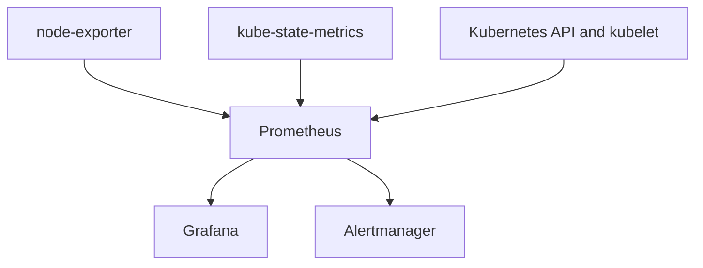

# K3s Observability

This directory contains the version-pinned and resource-tuned observability configuration for the three-server K3s homelab.

## Purpose

The monitoring stack provides cluster, node, and workload visibility using Prometheus, Grafana, Alertmanager, kube-state-metrics, and node-exporter.

This foundation will later support controlled incident testing and isolated, read-only AI-assisted incident analysis.

## Versions

- Kubernetes distribution: K3s `v1.36.2+k3s1`
- Helm CLI: `v4.2.4`
- kube-prometheus-stack chart: `88.3.0`
- Prometheus Operator: `v0.93.0`

## Architecture



- **Prometheus** collects and stores time-series metrics.
- **Grafana** queries Prometheus and visualizes the results.
- **Alertmanager** manages active alerts, grouping, silences, and routing.
- **kube-state-metrics** exposes Kubernetes object state such as desired and available replicas.
- **node-exporter** exposes operating-system and hardware metrics from every K3s server.
- **Prometheus Operator** converts custom resources into managed Prometheus and Alertmanager workloads.

## Configuration

- `namespace.yaml` declaratively creates the `monitoring` namespace.
- `kube-prometheus-stack-values.yaml` contains resource limits, retention, storage, and K3s-specific monitoring decisions.
- Grafana credentials are stored in the separately managed `monitoring-grafana-admin` Kubernetes Secret.
- No passwords, tokens, kubeconfig data, or live Secrets are stored in Git.

## Resource and Storage Plan

| Component | CPU request | CPU limit | Memory request | Memory limit | Storage |
|---|---:|---:|---:|---:|---:|
| Prometheus | 250m | 1 core | 512Mi | 1536Mi | 10Gi |
| Grafana | 100m | 500m | 128Mi | 512Mi | 2Gi |
| Alertmanager | 25m | 200m | 64Mi | 256Mi | 1Gi |
| Prometheus Operator | 100m | 500m | 128Mi | 256Mi | None |
| kube-state-metrics | 25m | 200m | 64Mi | 128Mi | None |
| node-exporter | 10m | 100m | 32Mi | 64Mi | None |

Prometheus retains metrics for seven days with an 8 GiB retention-size cap.

## K3s-Specific Decisions

Live socket inspection showed these endpoints were network-accessible:

- Kubernetes API server: `6443`
- Kubelet: `10250`

These metrics endpoints listened only on node loopback:

- Controller manager: `10257`
- Scheduler: `10259`
- Kube-proxy: `10249`
- Etcd metrics: `2381`

The loopback-only component monitors and their associated default rules are disabled. This prevents unreachable scrape targets and false alerts without weakening the K3s defaults by exposing additional ports.

## Validation

Render the pinned chart without changing the cluster:

```bash
helm template monitoring prometheus-community/kube-prometheus-stack \
  --version 88.3.0 \
  --namespace monitoring \
  --include-crds \
  --values kubernetes/observability/kube-prometheus-stack-values.yaml
```

Deploy or upgrade the pinned stack with rollback on failure:

```bash
helm upgrade --install monitoring prometheus-community/kube-prometheus-stack \
  --version 88.3.0 \
  --namespace monitoring \
  --values kubernetes/observability/kube-prometheus-stack-values.yaml \
  --atomic \
  --wait \
  --wait-for-jobs \
  --timeout 15m \
  --history-max 10
```

Inspect live resources:

```bash
sudo k3s kubectl -n monitoring get pods -o wide
sudo k3s kubectl -n monitoring get pvc -o wide
sudo k3s kubectl top nodes
sudo k3s kubectl -n monitoring top pods --containers
```

## Automated Validation

[GitHub Actions run 16](https://github.com/Capasiter/homelab-portfolio/actions/runs/31963638090) completed successfully on August 16, 2026. The OpenTofu, Ansible, and Helm observability jobs all passed. The Helm job installed Helm `v4.2.4`, verified chart `88.3.0`, rendered the committed values, and confirmed the generated manifest was not empty without using cluster credentials.

## Initial Live Validation

Validated on August 16, 2026:

- Helm release `monitoring` deployed successfully at revision 1.
- All monitoring containers became Ready.
- No monitoring pod restarts were observed.
- One node-exporter pod ran on each K3s server.
- Prometheus, Grafana, and Alertmanager PVCs were Bound.
- Cluster CPU utilization remained approximately 2–3%.
- Node memory utilization remained approximately 53–57%.
- Grafana displayed live cluster, namespace, and workload metrics.
- PromQL `min(up)` returned `1`, confirming all discovered targets were healthy.
- `web-demo` desired replicas returned `3`.
- `web-demo` available replicas returned `3`.

## Learning Queries

Confirm scrape health:

```promql
up
```

Confirm that every discovered target is healthy:

```promql
min(up)
```

Show desired `web-demo` replicas:

```promql
kube_deployment_spec_replicas{namespace="k8s-learning", deployment="web-demo"}
```

Show available `web-demo` replicas:

```promql
kube_deployment_status_replicas_available{namespace="k8s-learning", deployment="web-demo"}
```

A difference between desired and available replicas indicates that Kubernetes has not yet reached the declared state.

## Black-box Application Monitoring

`blackbox-exporter.yaml` deploys the version-pinned Blackbox Exporter, its HTTP probing configuration, and an internal ClusterIP service in the `monitoring` namespace.

`web-demo-availability.yaml` defines a Prometheus Operator `Probe` and `PrometheusRule`. Prometheus runs the `http_2xx` probe every 30 seconds against the internal `web-demo` service. The `WebDemoUnavailable` alert enters the firing state after one continuous minute of failed probes.

The exporter is limited to 100m CPU and 128Mi memory, runs as a non-root user, drops all Linux capabilities, uses a read-only root filesystem, and does not mount a Kubernetes service-account token.

### Controlled Availability Test

Validated on August 23, 2026:

| Stage | Desired replicas | Probe HTTP status | `probe_success` | Alert state |
|---|---:|---:|---:|---|
| Healthy baseline | 3 | 200 | 1 | Inactive |
| Controlled outage | 0 | 0 (no response) | 0 | Pending, then firing |
| Recovered | 3 | 200 | 1 | Inactive |

- Blackbox Exporter successfully resolved and probed `web-demo.k8s-learning.svc.cluster.local`.
- Scaling `web-demo` from three replicas to zero caused subsequent black-box probes to fail.
- `WebDemoUnavailable` transitioned from inactive to pending and then firing after its one-minute hold period.
- The Prometheus rule remained healthy with no evaluation errors.
- Restoring three replicas scheduled one Ready pod on each K3s server with zero restarts.
- Prometheus observed `probe_success = 1` after recovery.
- The alert returned to inactive with no active alert instances.

## Current Limitations

- Prometheus, Grafana, and Alertmanager each run as a single replica.
- Persistent storage uses node-local `local-path` volumes.
- Local-path volumes cannot be expanded and are unavailable if their assigned node is offline.
- Loopback-only K3s component metrics are intentionally not collected.
- Grafana is accessed through a local SSH tunnel rather than a public ingress.
- External alert notification routing is not configured yet.
- Blackbox Exporter currently runs as a single replica.
- Availability probing currently covers only the internal `web-demo` service.

## Next Steps

1. Complete repository validation, CI, pull-request review, and the v0.6.0 release.
2. Configure and test Alertmanager routing, delivery, acknowledgement, and recovery notifications.
3. Evaluate Blackbox Exporter redundancy and alert when the expected probe time series disappears.
4. Expand controlled testing to partial replica loss, node and network failure, slow responses, and intermittent failures.
5. Capture timestamped evidence to measure detection, firing, notification, and recovery latency.
