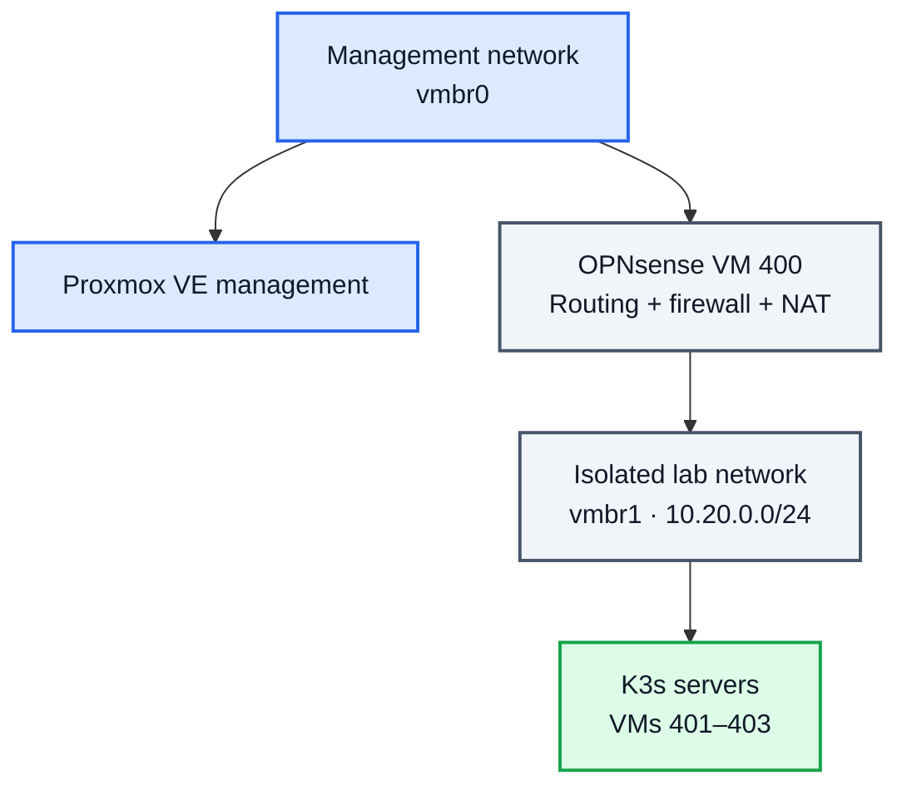

# Proxmox K3s VM Environment

This OpenTofu environment provisions three Ubuntu 24.04 virtual machines for a redundant K3s control plane on one physical Proxmox host.

> **Current status:** The K3s control plane is operational. Its API is available through kube-vip at `10.20.0.110`.

OpenTofu manages the virtual-machine lifecycle. OPNsense provides isolated routing, DHCP, DNS forwarding, and outbound NAT. Ansible manages the Linux baseline, K3s control plane, API VIP, and backup configuration. The monitoring stack is deployed with Helm, and Argo CD manages WebDemo with manual sync.

## Architecture


```mermaid
flowchart TD
    Management["Management network<br/>vmbr0"]
    Proxmox["Proxmox VE management"]
    Firewall["OPNsense VM 400<br/>Routing + firewall + NAT"]
    Lab["Isolated lab network<br/>vmbr1 · 10.20.0.0/24"]
    Nodes["K3s servers<br/>VMs 401–403"]

    Management --> Proxmox
    Management --> Firewall
    Firewall --> Lab
    Lab --> Nodes

    classDef control fill:#DBEAFE,stroke:#2563EB,color:#111827,stroke-width:2px,font-size:16px
    classDef boundary fill:#F1F5F9,stroke:#475569,color:#111827,stroke-width:2px,font-size:16px
    classDef runtime fill:#DCFCE7,stroke:#16A34A,color:#111827,stroke-width:2px,font-size:16px

    class Management,Proxmox control
    class Firewall,Lab boundary
    class Nodes runtime
```

OPNsense connects the two virtual networks:

- WAN interface on `vmbr0`
- LAN gateway at `10.20.0.1` on `vmbr1`
- DHCP and DNS services for the isolated lab
- Outbound NAT for updates and package installation

The K3s VMs attach only to `vmbr1`. Traffic between the VMs remains inside Proxmox and does not require a physical uplink on the lab bridge.

## Managed Nodes

| Node | VM ID | Reserved address | MAC address |
|---|---:|---|---|
| `k3s-server-01` | 401 | `10.20.0.101` | `02:00:00:00:04:01` |
| `k3s-server-02` | 402 | `10.20.0.102` | `02:00:00:00:04:02` |
| `k3s-server-03` | 403 | `10.20.0.103` | `02:00:00:00:04:03` |

Deterministic MAC addresses allow OPNsense DHCP reservations to provide stable addresses without embedding static network configuration inside the VM template.

## VM Configuration

Each node is provisioned with:

| Setting | Value |
|---|---|
| Operating system | Ubuntu 24.04 Noble |
| Template VM ID | 9100 |
| Clone type | Full clone |
| CPU | 4 cores, host CPU type |
| Memory | 6144 MB |
| Disk | 32 GB on `local-lvm` |
| Network bridge | `vmbr1` |
| Cloud-init user | `ansible` |
| QEMU guest agent | Enabled |
| Start on boot | Enabled |
| Startup order | 2 |
| Startup delay | 15 seconds |
| Shutdown delay | 60 seconds |
| Troubleshooting console | Serial socket with `VGA serial0` |

The source template was sanitized before conversion to a Proxmox template. It contains no embedded credentials, machine identity, SSH host keys, logs, or temporary files.

## Dependency-Aware Startup

OPNsense uses startup order `1`. The K3s nodes use startup order `2`.

This ensures the lab gateway starts before the cluster nodes. Proxmox reverses the ordering during shutdown so dependent cluster nodes stop before the firewall. Startup and shutdown delays give network services time to become available and guests time to stop cleanly.

## Scope Boundaries

This environment manages VMs `401–403`.

The following are prerequisites managed outside this OpenTofu environment:

- OPNsense VM `400`
- OPNsense DHCP reservations and firewall policy
- Ubuntu cloud-image template `9100`
- Proxmox storage and virtual bridges
- Proxmox API users, roles, tokens, and ACL assignments

OPNsense configuration exports and API-token secrets are sensitive and must never be committed to Git.

## Configuration Workflow

From `proxmox/opentofu/environments/k3s`, copy the sanitized example and protect the local configuration:

```bash
cp terraform.tfvars.example terraform.tfvars
chmod 600 terraform.tfvars
```

Update the local file with environment-specific values. Real `terraform.tfvars` files are ignored by Git.

Initialize and validate:

```bash
tofu init
tofu fmt -check
tofu validate
```

Review the complete execution plan:

```bash
tofu plan
```

Apply only after resolving the exact target resources and reviewing every proposed action:

```bash
tofu apply
```

Saved plans, state files, provider caches, and real variable files must remain outside version control.

## Deployment Validation

Live validation confirmed:

- All three VMs were cloned successfully from template `9100`
- Guest-agent results matched the declared MAC and reserved IP mappings
- Hostnames matched the OpenTofu `for_each` keys
- Cloud-init completed successfully on every node
- QEMU guest agent was active on every node
- Default routes used the isolated OPNsense gateway
- Outbound connectivity through OPNsense NAT succeeded
- DNS resolution succeeded
- A final full OpenTofu plan reported no changes
- No targeted-planning warning appeared in the final plan

Detailed evidence and troubleshooting notes are recorded in [K3s Live Validation](../../docs/k3s-live-validation.md).

## Management Access

The management workstation does not have a direct route into `10.20.0.0/24`. Management access now uses a dedicated unprivileged `k3s-jump` account on the Proxmox host as a forwarding-only SSH bastion.

The bastion uses a separate passphrase-protected key, denies password authentication and interactive shell access, and permits forwarding only to SSH on the three K3s nodes. This preserves isolation without modifying the upstream router or exposing the lab network directly.

Implementation and validation evidence are documented in [K3s Node Bootstrap Live Validation](../../../../ansible/docs/k3s-node-validation.md).

## Security Practices

- K3s nodes attach only to the isolated lab bridge
- Real variable files and OpenTofu state are ignored
- The committed example contains placeholder credentials only
- Proxmox automation uses a dedicated service identity
- Provisioning permissions are assigned through a purpose-built role
- API authentication and authorization failures were diagnosed separately
- Serial-console access remains available for recovery
- A final full plan verifies that targeted recovery work introduced no drift

## Current Follow-up

The original v0.4 deployment plan is complete. The API VIP, monitoring, off-server etcd backups, and manual Argo CD application delivery are documented in the portfolio README. Remaining work includes a passing isolated etcd restore, shared persistent storage and volume recovery, and broader failure testing.
